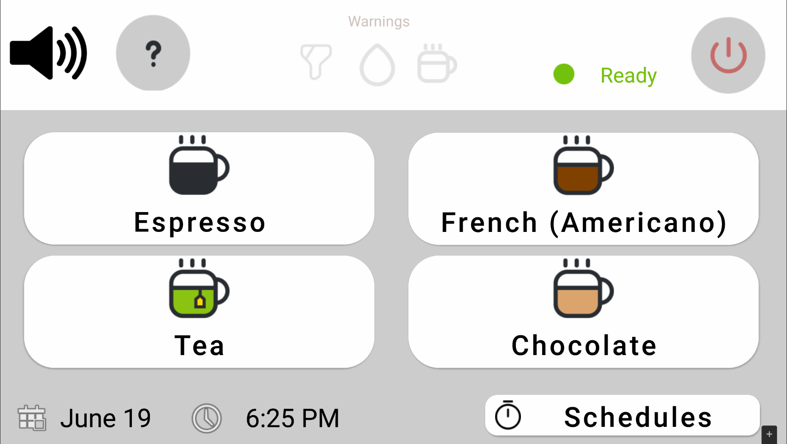
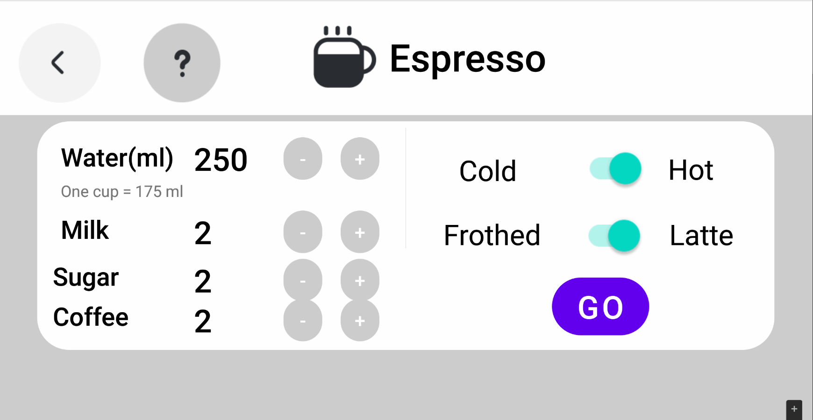
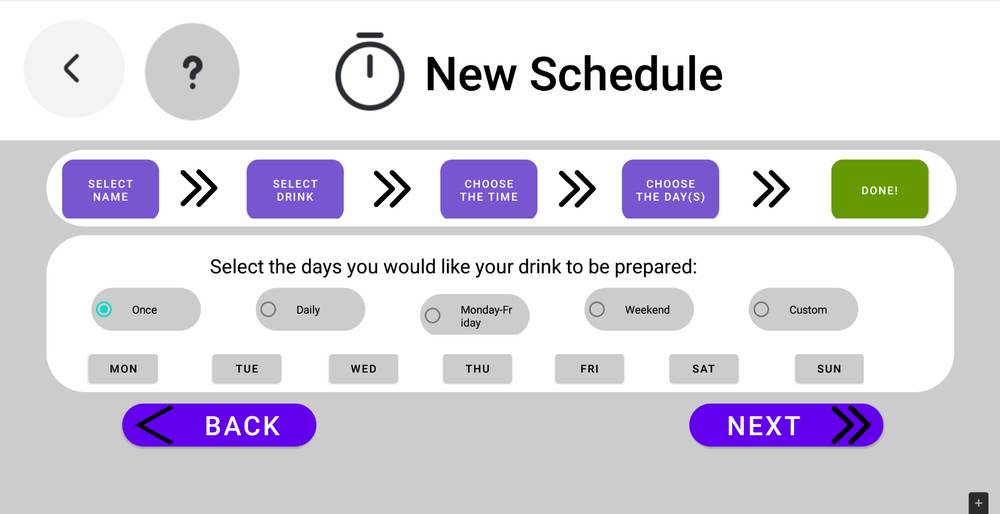

# Marine Coffee - A modern, accessible coffee machine GUI

An Android application aiming to provide a modern, accesible UI to a standard, commerical coffee machine. Supports ingredient selection, schedule creation and management, video tutorials and TTS for accessibility.
Developed as part of the "Human-Computer Interaction" course of the Athens University of Economics and Business. 

You can find a brief demo of the application [here](https://youtu.be/Cju-xMAUAUg).

Developed using Agile methodology. The full development documentation can be found [here](documentation/report.md). Includes base idea, requirements, implementation and design decisions as well as prototype evolution and the verification techniques  used during each of the development cycles. 

## Preview

## Project information
The project has been user tested in the following devices:
- Samsung Galaxy Tab S6 Lite
- Nexus 10 API 27 (AVD)

The project assumes the device is a tablet with a screen roughly the size of 1200 x 800 dp.

The application is targeted for devices operating Android 5 Lollipop (API level 21) and over.
