# Human-Computer Interaction: Term Assignment

#### Ιωάννης Γκιώνης 3190044
#### Τσίρμπας Δημήτρης 3190205

## Subject

In our assignment we will be attempting to develop a friendly User Interface (UI) for a common,
commercial coffee machine. The reasons that led us choosing this type of device are:

- Making drinks (e.g coffee, tea, hot chocolate) is a simple and repetitive task for most users.
- Most commercially available machines do not support widely requested features such as having
    a drink ready at a certain time each day.
- Machines that do, make use of a primitive and often counter-intuitive interfaces
(e.g few, small buttons).
- Most machines support people with visual disabilities poorly.

Our project thus strives to offer an easy-to-use, accessible interface supporting advanced features such
as automatic drink creation.  

This report is composed of 4 parts: The 1st, 2nd and 3rd development cycles of the project and an 
addendum where we place additional files and images pertaining to various development stages.

## Project information
The project has been user tested in the following devices:
- Samsung Galaxy Tab S6 Lite
- Nexus 10 API 27 (AVD)

The project assumes the device is a tablet with a screen roughly the size of 1200 x 800 dp.

The application is targeted for devices operating Android 5 Lollipop (API level 21) and over.

## First Cycle

The goals of the 1st development cycle are:

- Defining the base model on which the UI will be based
- Selecting and defining the features our prospective users will be interested in
- Producing mock-up versions of our various screens and menus
- Using the mock-ups to generate feedback from our users

### The model
The model we are using is the KRUPS coffee machine. It's an old model which specializes in producing
french coffee and espresso. It can also technically produce hot chocolate and tea, so it fits our 
requirements.

This model is also notorious for its poor UI. All its functions are directed using a lever and 4 
small buttons which have to be pressed in non-obvious sequences. It goes without saying that it is 
also a nightmare for people with visual impairments.

*Our base model*

### Target audience

Our target audience comprises of young students and professionals. The reasons we picked this 
particular group are:

- They are generally accustomed with technology and are thus more likely to choose a GUI rather than 
a traditional, tactile UI
- They make frequent, daily use of drinks (especially coffee) 

We also focus on people with visual impairments, as accessibility is one of the greater strengths of 
designing a graphical user interface.

### Functional Requirements

- The system must support 4 kinds of drinks: french coffee/americano, espresso, tea and hot 
chocolate.
- The system must warn the user in case of missing or low ingredients (e.g water, filters)
- The system must save the last used drink configuration for each drink and load it when that drink
is requested.
- The system must support repeatable schedules where the user can request a drink be made at a 
specific time, for a specific day.
- The system must support viewing, activating, deactivating and deleting schedules.

### Non-functional Requirements

- Each screen must be non-scrollable.
- For a given, ordinary task a maximum of 2 screen changes must be used.
- The system must be usable for people with visual impairments.
- A new user should get accustomed to the basic features within 2 minutes.

### Verification

We used three forms of verification for the 1st development cycle;

#### Questionnaires
Used to verify functional requirements and to gather general feedback about our 
design. Our questionnaire was given to 18 students, was comprised of 10 questions and was submitted 
using Google Forms. Information about the results of the questionnaire and how it impacted our 
decisions can be found in [Addendum#Cycle 1 Questionnaire findings](#cycle-1-questionnaire-findings).

#### Interviews
Participants were asked to suggest features and give us feedback
about specific design decisions. The interviews were kept mostly open and unstructured as to allow
more general suggestions since the design was still in its early stages. Most interviews concerned 
students from the 19-22 age group, as well as a professional designer, since we felt that input on 
our design decisions was insufficient up to that point.

#### Group verification
The project was presented to an audience of 15-20 people where many design aspects were discussed.
The original presentation can be found [here](presentations/cycle1_presentation_gr.pptx). 
Participants were quick to criticize key design decisions such as the way values were selected in 
the drink creation screens and the difficulty in discerning system warnings in the main screen.

### Results
Besides adapting our functional requirements, the feedback we received helped us adapt the general
design of our application. Below are two before-and-after pictures demonstrating the changes we made.
A full list of our final designs can be found in [Addendum#Mock-ups](#mock-ups).

#### Before

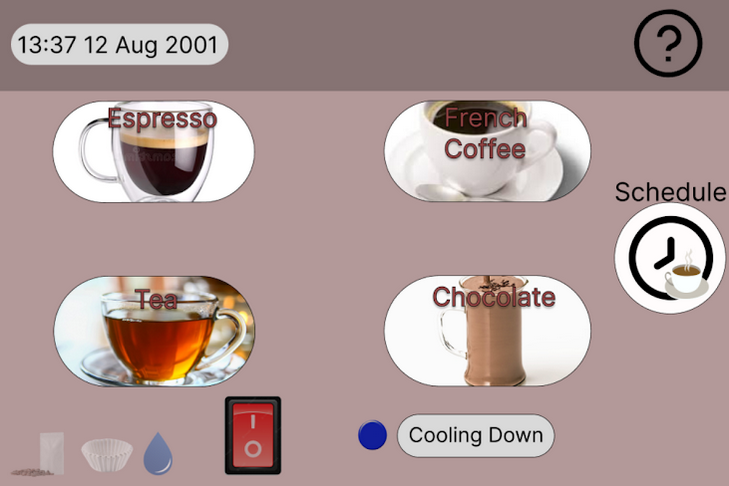
 *Old main menu*

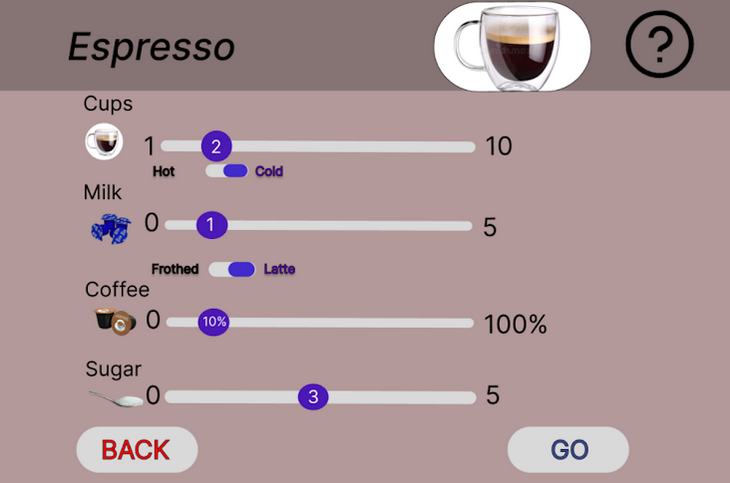
 *Old drink creation screen*

#### After

 *New main menu*

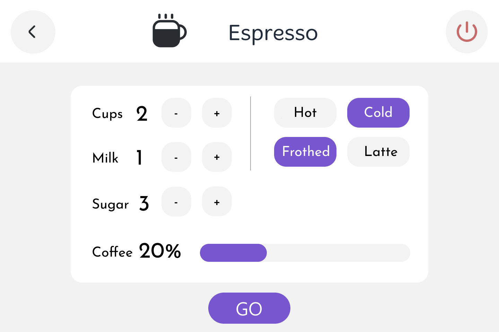
 *New drink creation screen*

## Second Cycle

### Goals
The goals of the 2nd cycle were:
- Design the prototype in Android.
- Implement basic functionality.
- Export the prototype to an Android device to allow realistic user verification.

### Target Audience
Our target audience remains the same in this cycle.

### Functional Requirements
Our overall functional requirements remain the same. In this cycle we attempt to implement all basic
functions, including:

- Schedule creation and management
- Drink creation screens
- Saving and loading the last drink configuration for each drink

### Non-functional Requirements
Our overall non-functional requirements remain the same, and are used to guide our Android
implementation.

### Verification
We used two forms of verification for the 2nd development cycle:

#### Questionnaires
Used to verify functional requirements considered for the 3rd development cycle and general design 
choices. The questions, results and derived decisions can be found at 
[Addendum#Cycle 2 Questionnaire findings](#cycle-2-questionnaire-findings).

### Talking subjects
Testers were given a copy of the prototype running in an actual Android device and were instructed
to explore the application with the following goals, while communicating their thought process 
with the test supervisor:

1. Create four drinks of different types.
2. Create a new schedule.
3. Delete the default schedules.

The testing revealed both strong and weak points of the prototype:

##### Pros:
- The application was very easy to navigate.
- The general design of the application was remarked as being "quite enjoyable".
- There were no issues with user confusion or hesitation.

##### Cons:
- The drink creation screen was seen as ambiguous in its phrasing ("Cups", arbitrary quantities for
chocolate, sugar).
- The binary buttons in the drink creation screen were seen as confusing.
- The button design in general, in its current implementation was supported poorly by the device
and thus was a constant source of complaints.

### Results
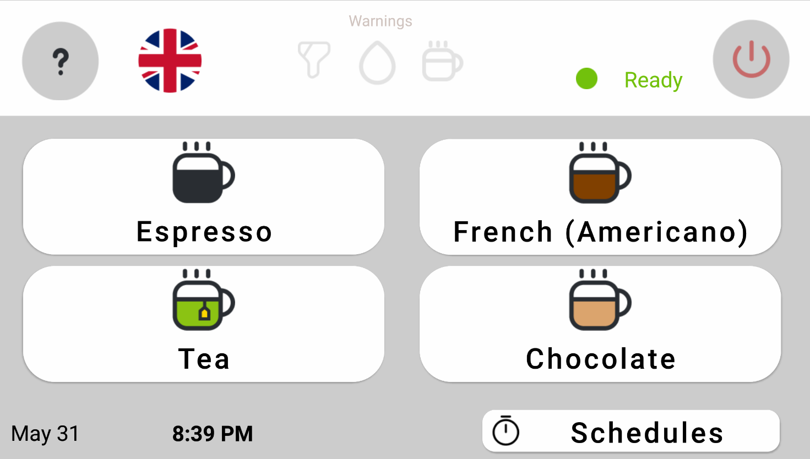
 *The main menu screen*

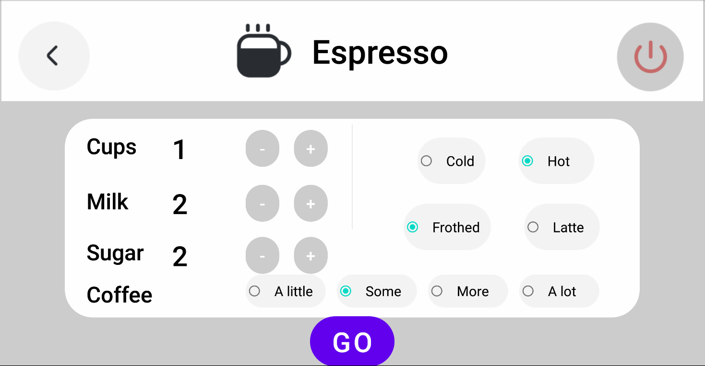
 *One of the drink creation screens*

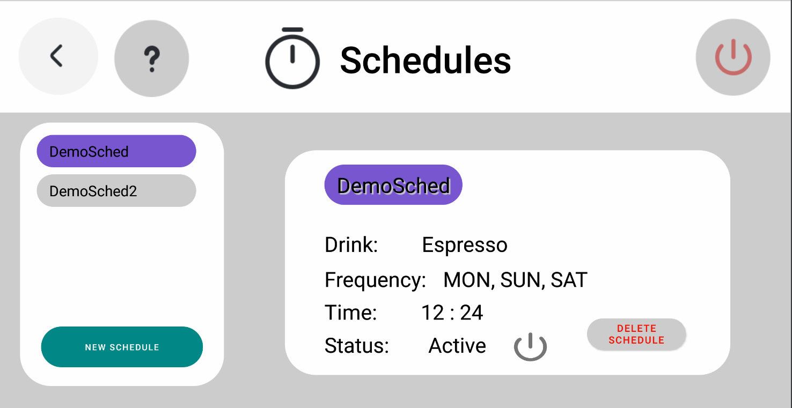
 *The manage schedules screen*

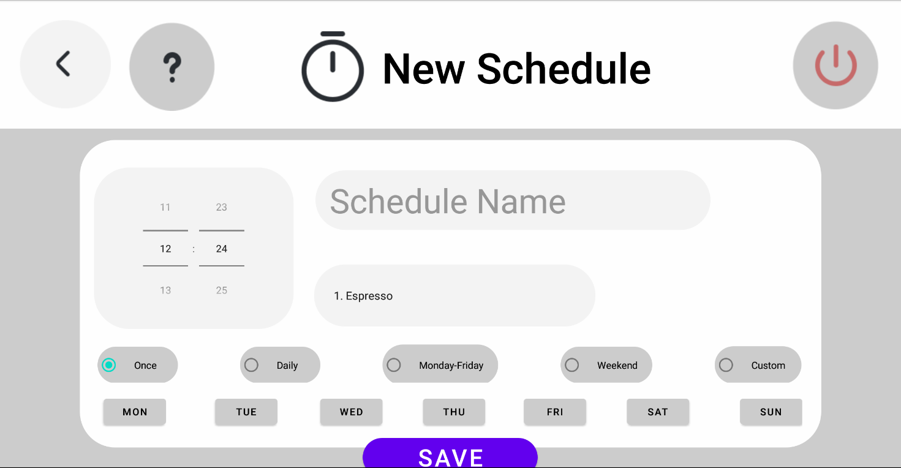
 *The schedule creation screen*

## Third Cycle

### Goals
The goals of the 3rd cycle were:
- Add almost complete functionality in Android.
- Use A.I. solutions where desired by the users.
- Refactor UI screens according to user feedback.
- Implement quality-of-life (QoL) improvements in our main UI screens
- Record and integrate video tutorials.

### Target Audience
We shift our target audience from strictly young students and professionals to also including 
the elderly. The elderly as a group have a greater difficulty in understanding and handling graphical
user interfaces, while mostly suffering from low-to-mid visual impairments. Our app therefore will 
need to address both of these concerns.

This scope change also leads us to dropping the severely visually impaired from our core target group.
We will instead rely on shared functionality with our core target groups (such as TTS services) and 
optimising native Android utilities (such as implementing Android accessibility tips and facilities
which are used for screen readers).

More about our decision for this particular scope change can be found in the 
[attached document](presentations/GUI%20για%20Αυτόματη%20Μηχανή%20Καφέ.pptx).

### Functional Requirements
In this cycle we attempt to additionally implement the following functions:

- TTS service for user action confirmation and for helping navigation for the visually impaired.
- Video tutorials for each screen.
- Refactoring the schedule creation screen to split the schedule details in distinct, progressive 
phases, while respecting the non-functional requirements set in Cycle 1.
- Implementing all the graphical changes outlined in the current verification cycle.

By implementing video tutorials and by employing a TTS service in our application, we hope to 
accommodate the elderly in particular, as both of these features are intuitive for new users, even
those not familiar with technology.

### Non-functional Requirements
We use this cycle to strictly enforce compliance with our existing non-functional requirements. This 
is made more effective by using feedback from a variety of verification sources we have acquired so 
far. Our core non-functional requirements remain the same.

### Verification
We used four forms of verification for the 3rd development cycle:

#### Group presentation
As with Cycle 1, the prototype (shown via a commercially available Tablet device) and the 
[previously linked presentation document](presentations/GUI%20για%20Αυτόματη%20Μηχανή%20Καφέ.pptx)
were used to showcase the evolution, scope changes and decisions as well as the new 
functionality of our prototype to a group of approximately 12 people. 

The feedback acquired was instrumental in shaping our decisions for many minor and major changes. 
The key points brought up by the audience were:

- The wasted vertical space occupied by the 'GO' button in the drink creation screens, which forced
the layout to be much more restricted, and led to a poor visual impression by the users.
- The extremely cluttered and confusing layout of the schedule creation screen.
- Our application currently assumes it is handled by the same user, or users with similar needs. This
assumption is reflected in our automatic drink loading, which always loads the last configuration for
each drink, for user convenience. In order to make the application more useful in multi-user 
environments, it was proposed that a face-recognition system could be built in, which would 
automatically select the user's preferred drink with no further user intervention.

#### Interviews
Many post-hoc interviews were conducted after the key weaknesses of the application were revealed in
the group presentation. These in-person interviews built upon the revealed problems and their 
possible solutions. Some focused on the technical challenges, such as problems endemic to our 
application's migration to the commercial device, others on the design and space management of our 
layouts, and others on possible new features and functions.

We also conducted an interview with a person knowledgeable about severe visual impairments and 
the functions provided by Android devices for user suffering from them. Our attention was directed to the 
[TalkBack](https://support.google.com/accessibility/android/answer/6283677)
system, which is the default screen reader for Android devices. Our assumption so far was that if we
programmatically implemented all accessibility tips and facilities the Android framework gives us 
access to, it would translate to a decent experience by users with severe visual impairments. This 
interview however highlighted the importance of testing the TalkBack system ourselves, in order to
guarantee smooth navigation and convenient gestures (which are used by TalkBack as alternative user
input).

#### Talking subjects

We once again introduced our prototype to volunteers, following the same procedure as with the 2nd 
cycle. Some issues were identified with the volume, placement and size of the tutorial videos, which
were addressed. Comments were mostly positive otherwise, especially concerning the (improved) manage
schedule screen.

#### Usability inspection

We introduced a design expert as well as long-time testers as evaluators. The evaluators were asked
to use the application and then fill a [brief form](https://forms.gle/b1uAdSWcSg8iyCcz8).

### Results

 *The main menu screen*

 *One of the drink creation screens*

 *The schedule creation screen*

### Future Work
Future development cycles would be used to expand the functionality of our application. 

- Extensive testing with the Android TalkBack framework must be performed to guarantee easy 
navigation and functionality for the severely visually impaired.
- Face recognition for user personalization should be explored. By using the device's camera and a 
traditional, pretrained Convolutional Neural Network (CNN), our device should be capable of this task.
Alternatively, traditional user verification methods such as finger print recognition could be used instead.

## Addendum

### Cycle 1 Questionnaire findings

Our original form can be found [here](https://forms.gle/RRxYVQZFafGN1ZDt6). Note that the stats
presented below are not a comprehensive list of all the questions.

We should first verify that the responders belong in our target audience;

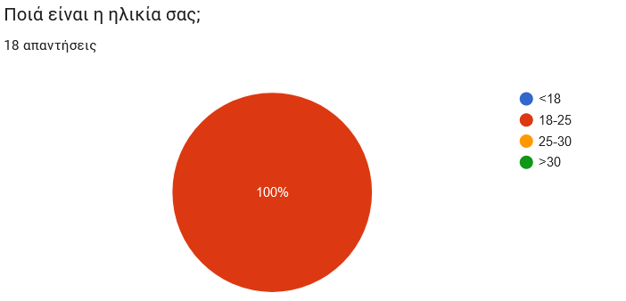
 *The age of the responders*

We must now check our assumptions that our users;
1. Drink coffee on a regular basis
2. Want a graphical UI for their coffee machine
3. Want a programmable schedule for making drinks 

*How often our responders drink drinks*

We can see that more than 50% of our users drink some sort of drink on a daily basis, with only 27%
declaring rare/no use of drinks.

 *How many responders would find a GUI coffee machine useful*

While not essential to them, most responders would find a GUI somewhat useful.

 *How many responders would find a scheduling feature useful*

We can see that a clear majority believe such a feature would be useful.

We can now start asking about the qualitative characteristics of our app:

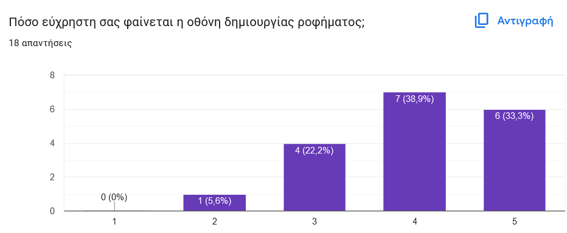
 *Ease-of-use of the drink creation screen*

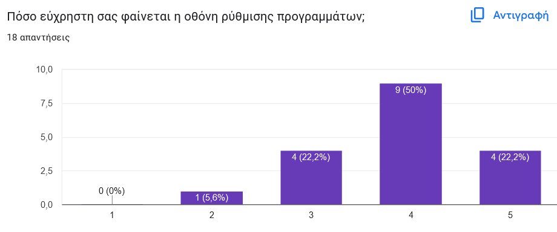
 *Ease-of-use of the drink scheduling screen*

 *General app design*

Our findings indicate that our responders feel that our main screens are well understood, but there
are complaints about our general design. These (according to open answers given at the end of the
questionnaire), concerned the font, images and background color used.

### Cycle 2 Questionnaire findings
Our original form for the 2nd cycle can be found [here](https://forms.gle/WkicWfT1VTkNNupj7).

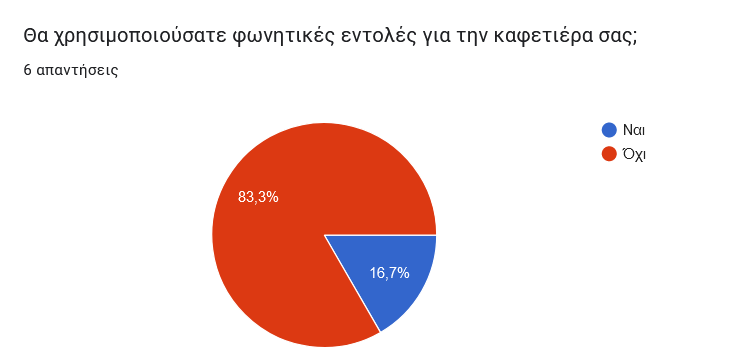

*How many of our responders would like voice commands for their coffee machine*

Even with a small sample size (N=9), this demonstrates the unwillingness of users with no
visual impairments to use any form of voice commands, and was a principal argument for not 
implementing our own, specialized A.I. solutions for this problem in this cycle.

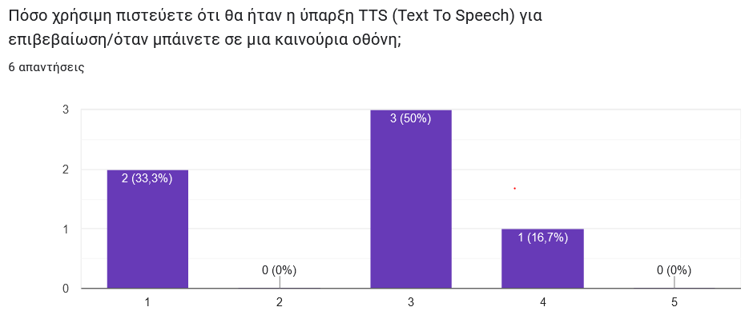
*Whether our responders would appreciate a built-in TTS service*

We note a slight indifference to the presence of a TTS system for our application. We go through with
the system, in order to help new users and users with non-debilitating visual impairments.

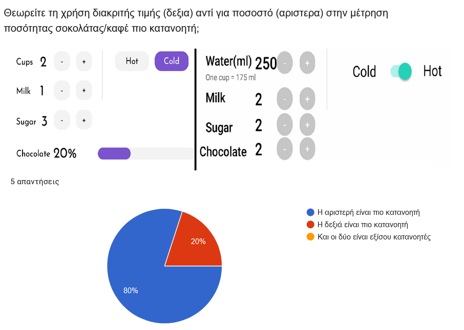
*Whether our users would prefer using a continuous bar for ingredients instead of +/- buttons 
(spliced with original image).*

While the results direct us towards using a continuous bar for the ingredients (left image), 
subsequent interviews revealed that the difference is not normally noticeable in many 
instances. We kept the design on the right, since it helped us improve the overall layout by freeing up 
space.

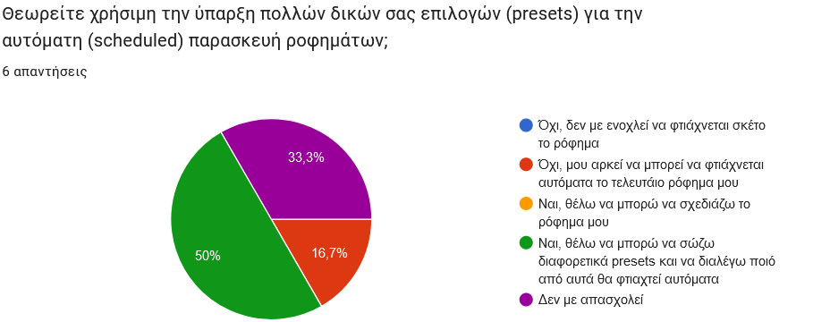
*What kind of drink presets users would be interested in.*

Our data is not conclusive as to whether a complicated system of custom saved presets would be beneficial
for our application overall. We hold off on implementing such a system, considering the multi-user,
last-saved configuration, based on face-recognition outlined in Cycle 3.

### Mock-ups

This section includes the rest of the final mock-up screens developed during the 1st development cycle.
A full list of images for each development cycle can be found in the `documentation\images` directory.

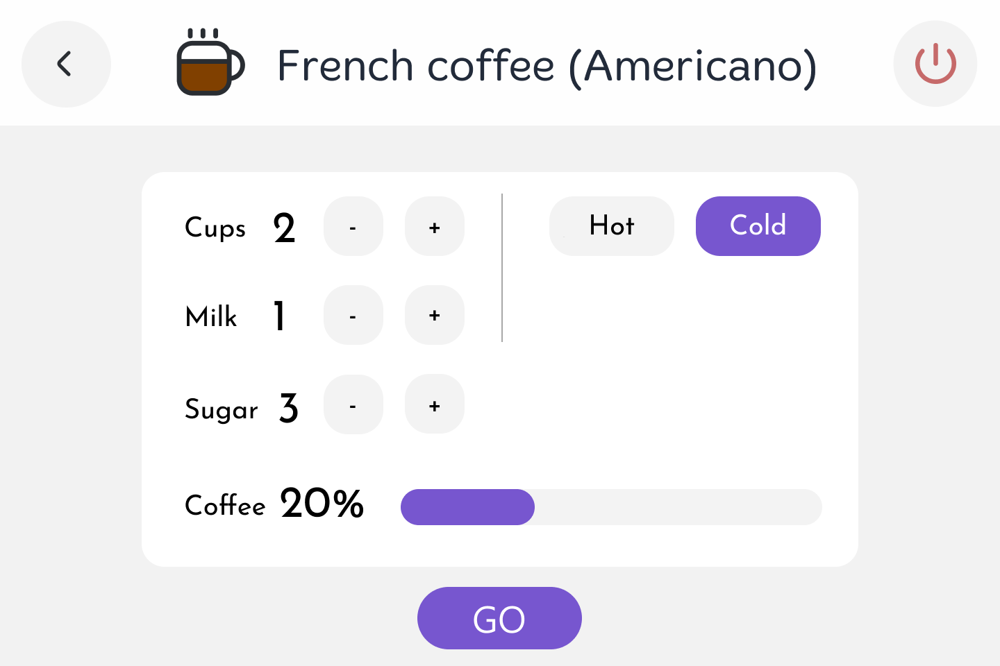
 *French coffee creation screen*

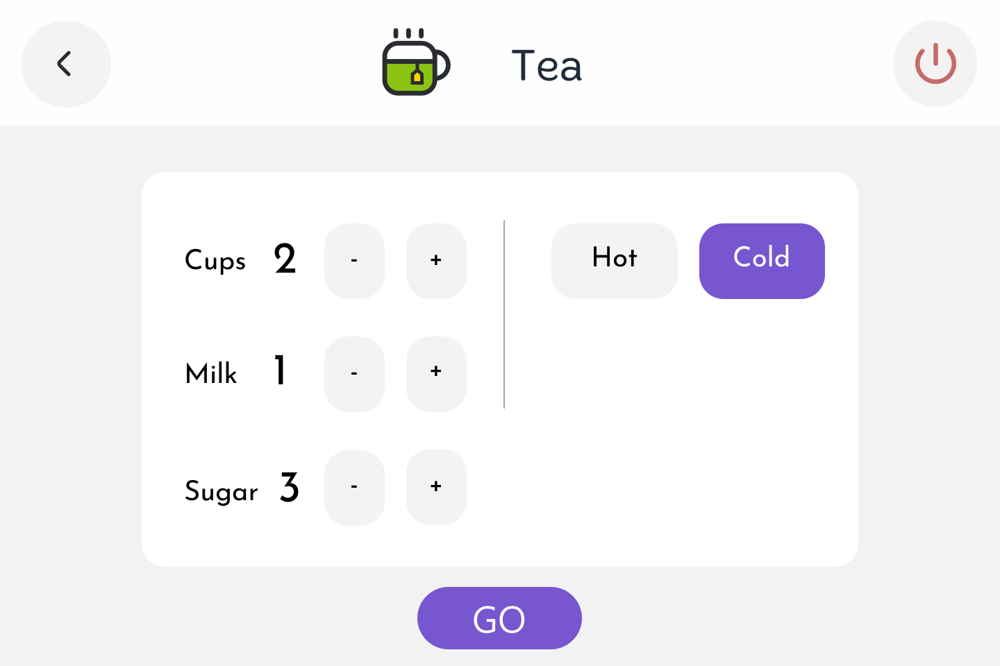
 *Tea creation screen*

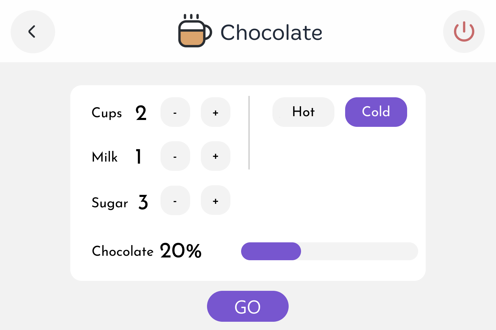
 *Hot chocolate creation screen*

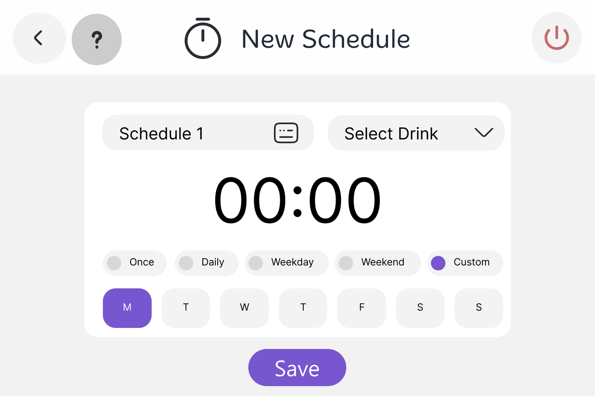
 *Schedule screen*

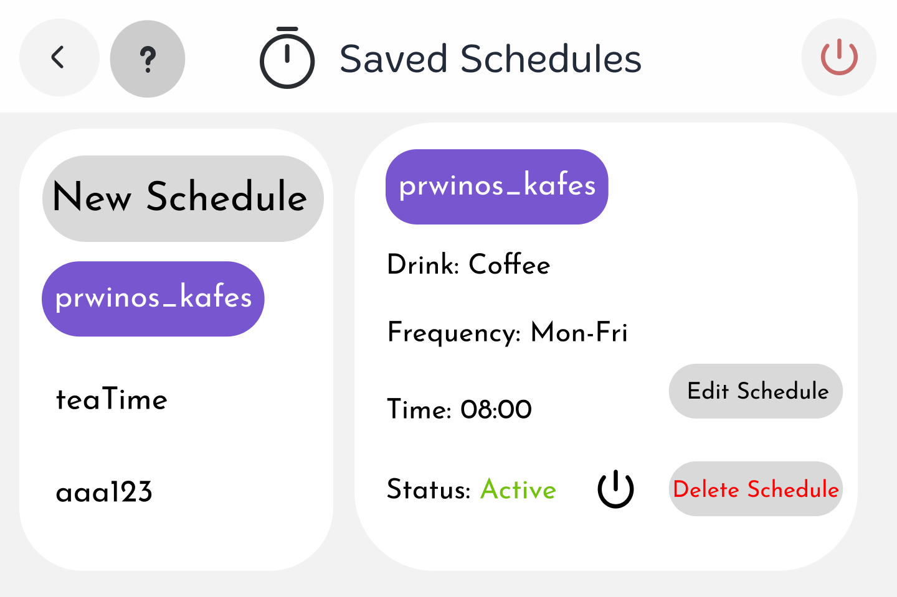
 *Schedule management screen*

